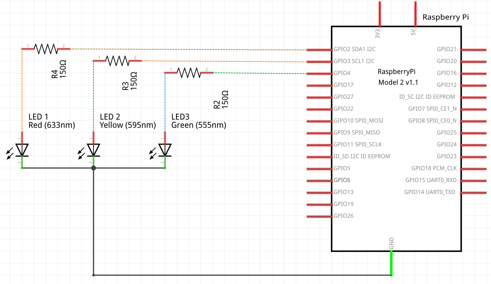
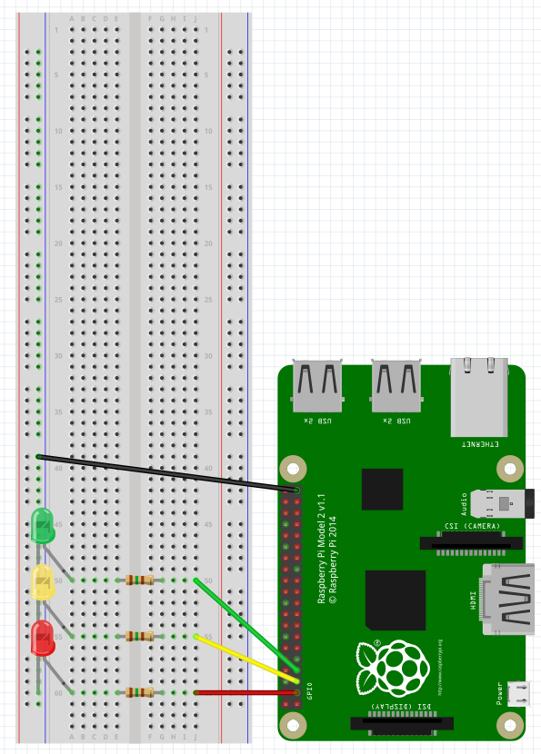
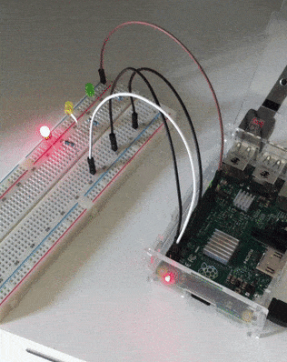

# Traffic Lights

This experiment will show you how to create automatic traffic lights.

## Needed Materials

- 1 Breadboard
- 3 LEDs (5mm) - The ones I own operate at 1,9V-2,1V and 20mA
- 3 150Ω Resistors (anything slightly above this will work, but 150Ω is ideal)
- 4 Male/Female Jumpers


## Instructions

### Electronics

As we did on [our single-led experiment](../single-led/README.md), we will calculate how much resistance we need for a single LED. For this experiment we're going to use the same led we did [that time](../blink-single-led/README.md), therefore we know we've gotta use a 150Ω resistor.

If you don't have a 150Ω resistor available, anything slightly higher will work, but your led may not be as bright as it would be with a 150Ω resistor.

This time, **we will use pins 3, 5 and 7 to supply power**. We will do this because all of them are "programmable pins", thus we will be able to turn them on and off.

We won't be able to use a single pin as a power supply because we need each one of the LEDs to have a different behaviour, so we need to control each one of their power supplies.

Before supplying power to the LEDs we oughta use our 150Ω resistors and make sure the LEDs' longer legs is are the plus side. After this, all we've gotta do is take the current back to RaspberryPi's GND pin (pin number 6).

### Code

For this experiment we will need [Node.js (check this link if you don't know how to install it on your RaspberryPi)](http://blog.wia.io/installing-node-js-v4-0-0-on-a-raspberry-pi/) and [some code](./code.js).

I highly recommend you to clone this repository on your Pi using:

```
$ git clone https://github.com/lucasfcosta/raspberry-gpio-experiments
```

Now go to the `traffic-lights` folder and run `npm install` to install the dependencies for this project. In this case we will only need a module called [`rpi-gpio`](https://www.npmjs.com/package/rpi-gpio) in order to control our GPIO pins.

Okay, we've got everything ready to run! Go to your terminal and run our [`code.js` file](./code.js) using:

```
$ sudo node code.js
```

If you've done everything right your traffic lights should already be working.

[**If you need an explanation on what the code does, its own file has lots of useful and detailed comments, take a look at it. I'm sure you will understand everything you need to.**](./code.js)

**WARNING:** Make sure to check your LEDs' specs before trying this. The operation Voltage and Current of it may be different from mine. These values are also called `Forward Voltage` and `Forward Current`, respectively.


## Circuit Diagram

Take a look at [this image](../rp2-pins.png) or [at the pinout diagrams on the main README file](../README.md#my-setup) if you need help locating those pins.




## Simulation

This is an accurate image illustrating the circuit using a real Raspberry Pi 2 Model B.




## Cool Picture


